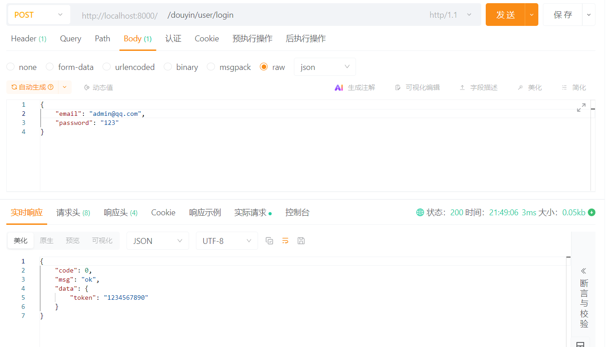
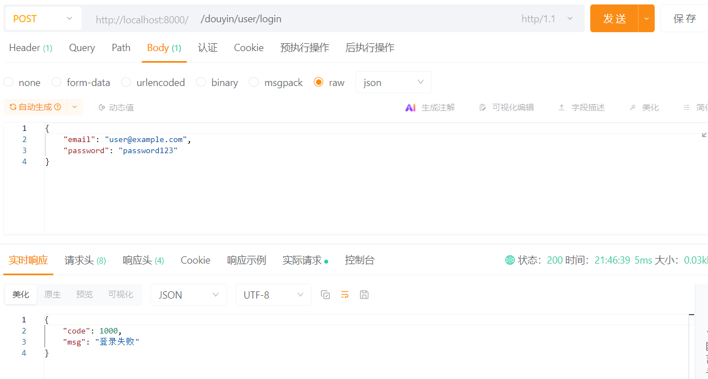

# 示例代码


## 代码结构

```   
go-mall/
├── apis     # 存放所有的api
│   └── user    # 用户api
│       ├── etc    # 用户api配置文件也需要在config文件夹下定义与声明
│       │   └── user-api.yaml 
│       ├── internal     
│       │   ├── config    # 声明配置文件 
│       │   │   └── config.go
│       │   ├── handler    # 路由处理函数
│       │   │   ├── loginhandler.go
│       │   │   └── routes.go 
│       │   ├── logic
│       │   │   └── loginlogic.go    # 主要业务逻辑代码，这里进行调用rpc服务
│       │   ├── svc
│       │   │   └── servicecontext.go    # 管理方法上下文，可以进行初始化mysql等服务供全局使用
│       │   └── types
│       │       └── types.go 
│       ├── user.api    # 编写api接口，通过命令生成代码
│       └── user.go    # 启动入口
├── common    #存放一些公共模块，以便于组员使用
│   ├── config    #一些通用配置，避免在多个服务冗余
│   │   └── config.go
│   ├── consts    # 常量
│   │   ├── biz    # 业务相关常量
│   │   │   └── user.go
│   │   └── code    # 响应码
│   │       └── code.go
│   ├── middleware    # 中间件
│   │   └── auth.go
│   ├── response    # 响应封装
│   │   └── base.go
│   └── utils     # 工具包
│       └── cryptx
│           └── crypt.go
|
|—— test    #测试单元
|
├── construct # 
│   ├── depend
│   │   ├── conf
│   │   │   └── redis.conf
│   │   ├── docker-compose.yaml
│   │   ├── README.md
│   │   └── sql
│   │       └── init.sql
│   └── observability
│       ├── conf
│       │   └── prometheus.yml
│       ├── docker-compose.yaml
│       └── README.md
├── dal # 数据库层
│   └── model
│       └── user    # 通过goctl生成sql代码
│           ├── usersmodel_gen.go
│           ├── usersmodel.go
│           ├── user.sql
│           └── vars.go
└── services
    └── auths
        ├── auths
        │   ├── auths_grpc.pb.go
        │   └── auths.pb.go
        ├── authsclient
        │   └── auths.go
        ├── auths.go
        ├── auths.proto    # 定义的rpc服务，通过goctl进行生成代码
        ├── etc
        │   └── auths.yaml
        └── internal
            ├── config
            │   └── config.go
            ├── logic
            │   └── authenticationlogic.go
            ├── server
            │   └── authsserver.go
            └── svc    # 与api的svc类似
                └── servicecontext.go
```


## 响应api格式
- 参考 [统一响应格式用法](https://go-zero.dev/docs/tutorials/http/server/response/ext#code-data-%E7%BB%9F%E4%B8%80%E5%93%8D%E5%BA%94%E6%A0%BC%E5%BC%8F%E7%94%A8%E6%B3%95)

handler
```go
func LoginHandler(svcCtx *svc.ServiceContext) http.HandlerFunc {
	return func(w http.ResponseWriter, r *http.Request) {
		var req types.LoginReq
		if err := httpx.Parse(r, &req); err != nil {
			// 返回自定义错误
			xhttp.JsonBaseResponseCtx(r.Context(), w, err)
			return
		}
		l := logic.NewLoginLogic(r.Context(), svcCtx)
		resp, err := l.Login(&req)
		if err != nil {
			xhttp.JsonBaseResponseCtx(r.Context(), w, err)
			return
		}
		xhttp.JsonBaseResponseCtx(r.Context(), w, resp)
	}
}

```

logic
```go

func (l *LoginLogic) Login(req *types.LoginReq) (resp *types.LoginRes, err error) {
	if req.Email == "admin@qq.com" {
		return &types.LoginRes{
			Token: "1234567890",
		}, nil
	}
	return nil, errors.New(1000, "登录失败")
}

```


### 请求成功


### 请求失败

